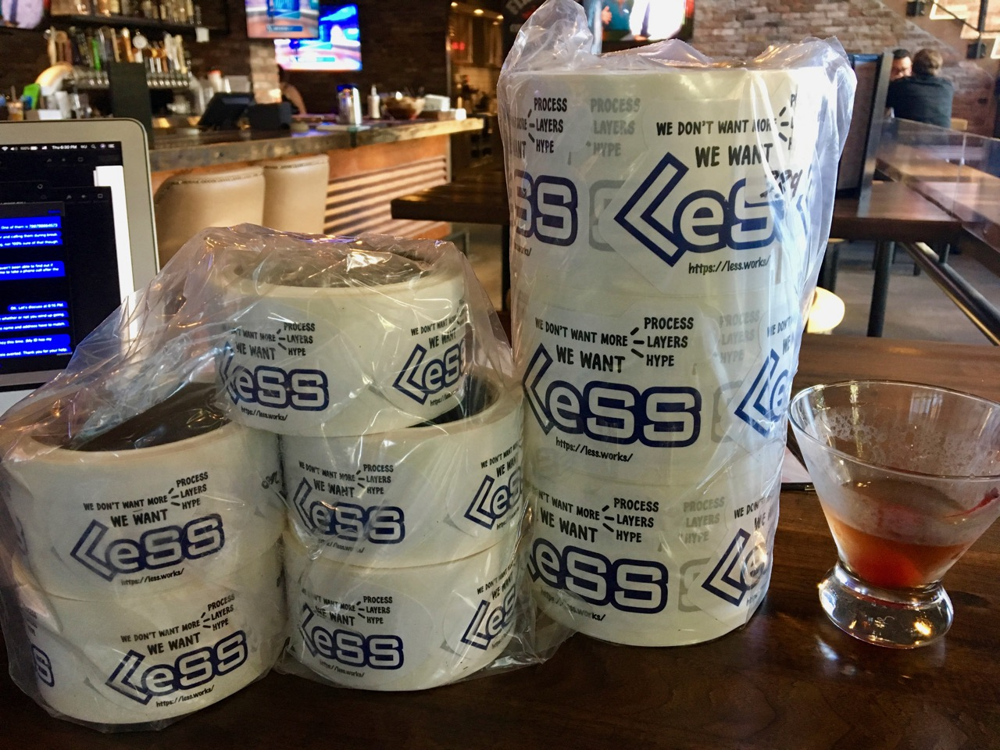

Join our [LinkedIn Group](https://www.linkedin.com/groups/6968022/) or
our [Slack Group](mailto:viktor@odd-e.com?subject=Please-send-Slack-invite).

We have stickers at the Agile 2019 Exhibition Hall, Fans Of LeSS booth
(in the cool kids' corner, next to GitLab).  Wear yours proudly!

If you are at Agile 2019, your tote bag should contain a small blue
comic book entitled
[_Why Scrum Isn't Making Your Organization Very Agile: Misconceptions About The Product Owner Role, And What To Do About Them_](https://seattlescrum.com/downloads/Why-Scrum-Isnt-Making-Your-Organization-Very-Agile-Product-Owner-Misconceptions.pdf){:target="_blank"}.
This is based on a video which was
[endorsed](https://twitter.com/TotherAlistair/status/1136145401311088640)
by our hero Alistair Cockburn.  Please dig this out of your bag and
share it with your colleagues.

Join us at the fourth annual
[LeSS Conference in Munich](https://less.works/less-conferences/2019-munich/index.html){:target="_blank"}.

Write to us to offer moral support!

Share this website on social media!
