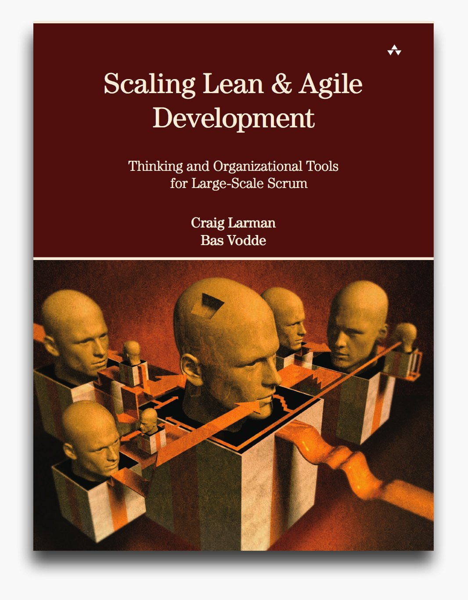
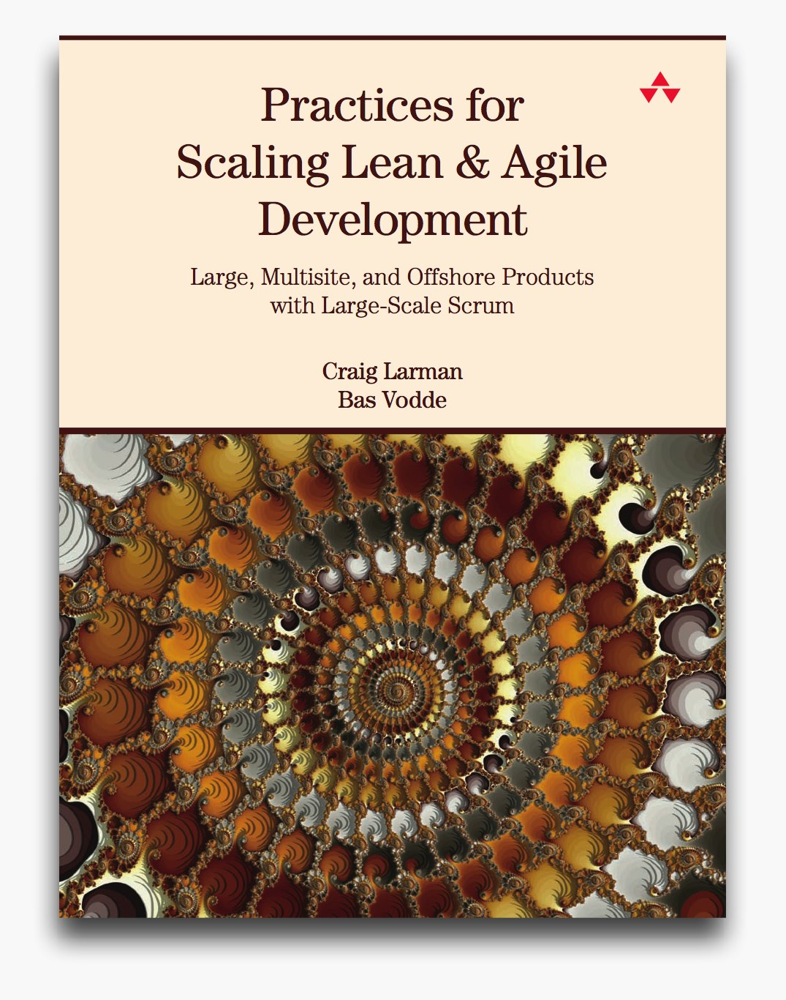
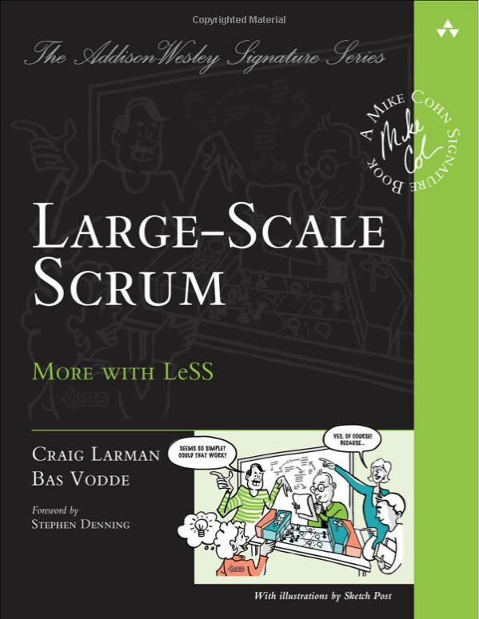

LeSS (see <https://less.works>{:target="_blank"}) is a principled approach to increasing
an organization's ability to *learn* and *adapt to reality*. LeSS is based
on the experience of active software developers working with a lot of
customers in a lot of domains.  It addresses the core organizational
design problems at the root of inagility.  LeSS is described by three
books over the past decade, coaching,
[training](https://less.works/courses/less-courses.html),
[conferences](https://less.works/less-conferences/2019-munich/index.html),
dozens of real life [experience reports](https://less.works/case-studies/index.html), and
a growing [community](https://less.works/resources/communities.html).

## Some Of The LeSS Videos
 
 




## The LeSS Books
*2008*
*2010*
*2014*

